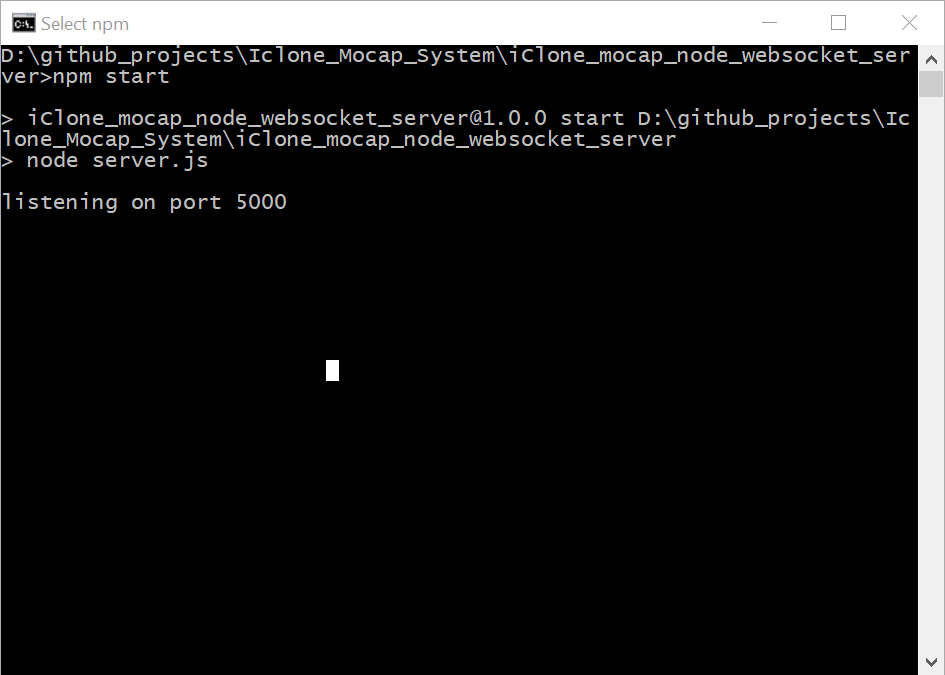
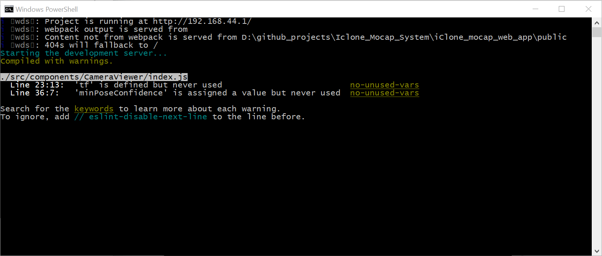
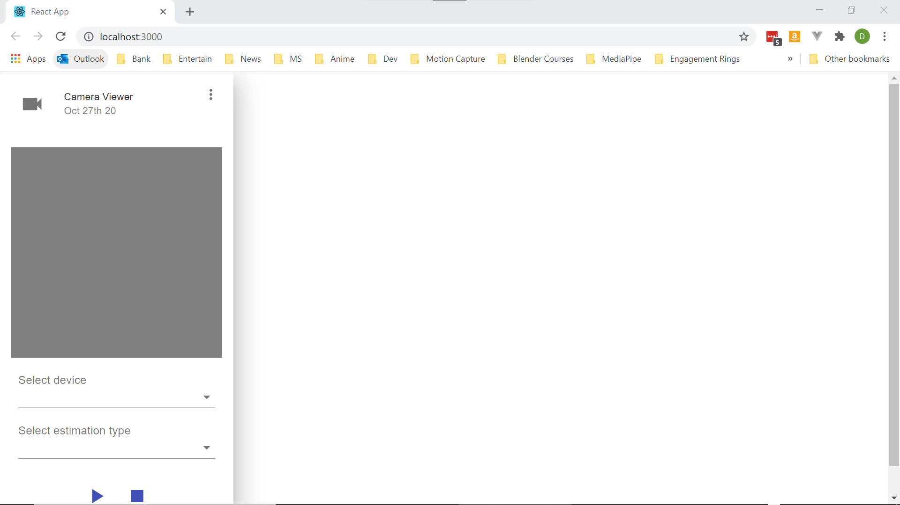
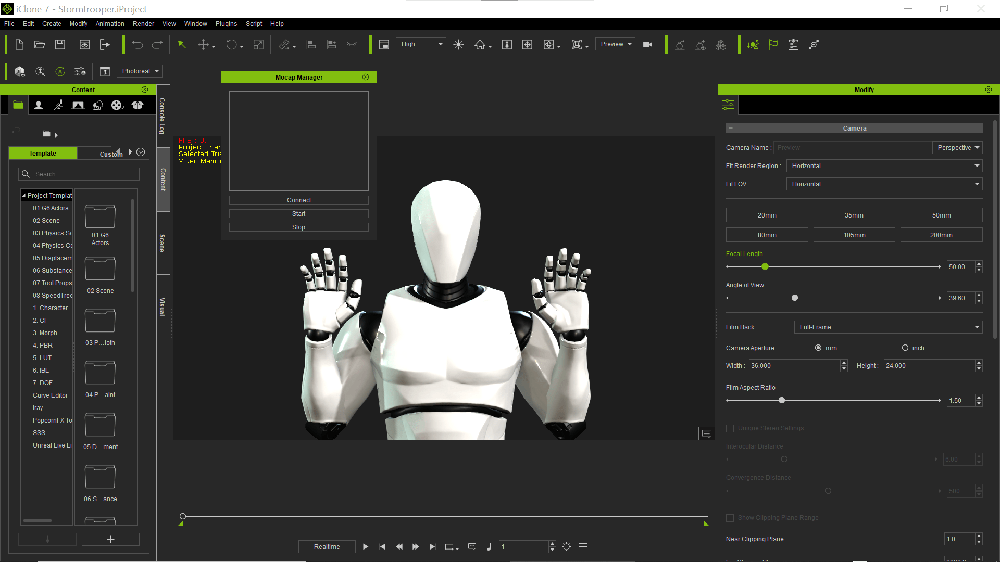

# Build And Run

Download this repository and the two below

<a href="https://github.com/delebash/iClone_mocap_plugin" target="_blank">iClone_mocap_node_websocket_server</a>

<a href="https://github.com/delebash/iClone_mocap_plugin" target="_blank">iClone_mocap_plugin</a>

1) Create a parent folder such as iClone_mocap
2) Extract each of the downloaded repos into that folder

    Should look like this
    
    iClone_mocap >
    
    --iClone_mocap_node_websocket_server
    
    --iClone_mocap_web_app
    
    --iClone_mocap_plugin

3) You will need to have <a href="https://nodejs.org/en/" target="_blank">nodejs</a> installed

    Current tested version is 14.15.0 LTS

4) From a command prompt

    run npm install inside folder iClone_mocap_node_websocket_server
    
    run npm install inside folder iClone_mocap_web_app

5) From a command prompt inside folder

    iClone_mocap_node_websocket_server 
    
    run npm start
    
    You should see
    
    
6) From a command prompt inside folder

    iClone_mocap_web_app
    
    run npm start
    
    You should see
    
    
7) A webpage should open at http://localhost:3000/
    
    You should see
    
    
8) Start iClone
    
    Open iClone project Stormtrooper.iProject located inside folder iClone_mocap_plugin
    
9) Select the character by clicking on it

10) In iClone choose menu option Script > Load Python

11) A dialog box will open for you to choose a python     file to run.  Select main.py inside folder           iClone_mocap_plugin

    You should see
    
    
    
12) Click the connect button

    You should see Joined room python client
    
    
    
13) 

    

